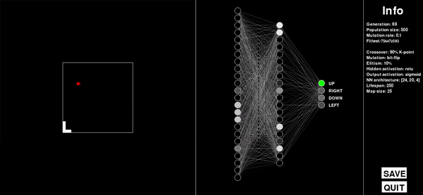
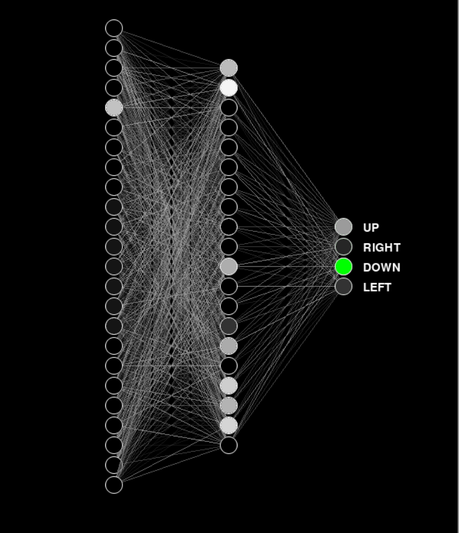
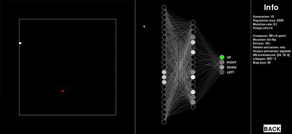
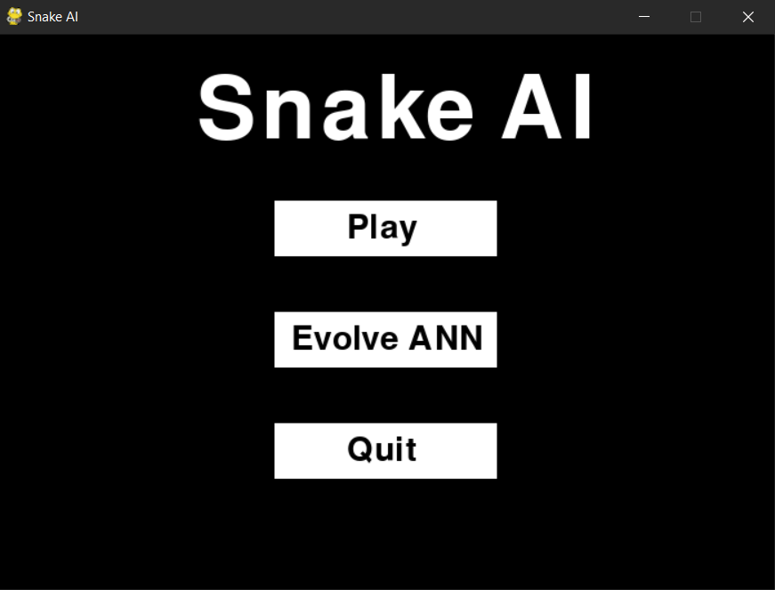
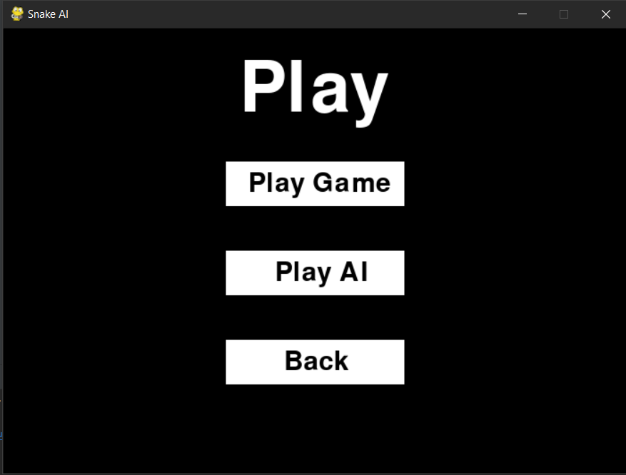
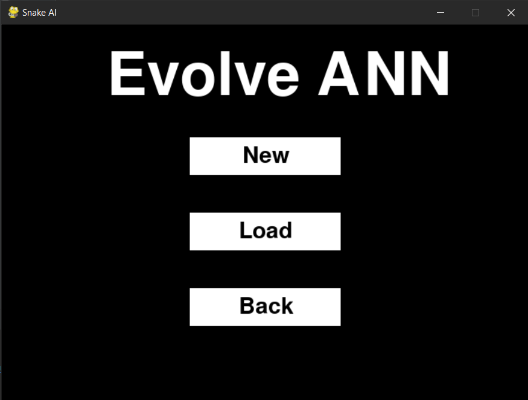
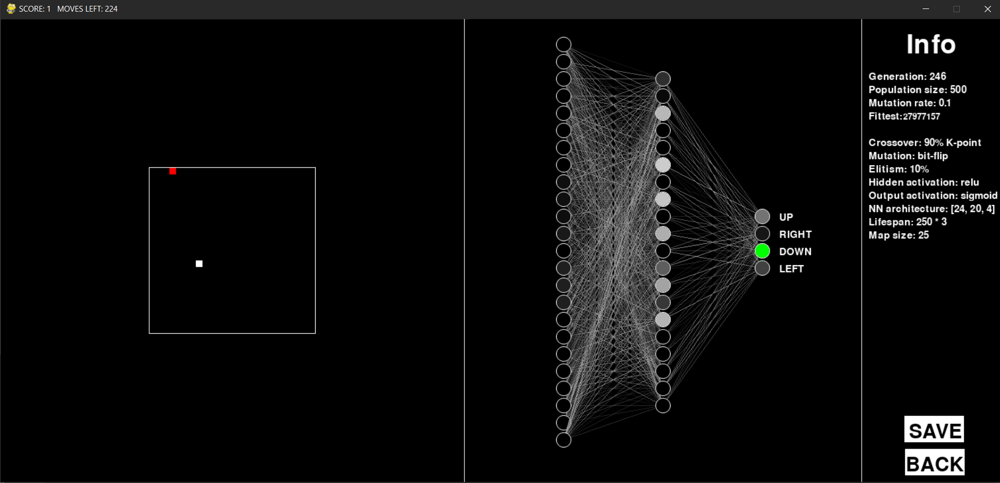

# Snake AI


## Assignment
Using genetic programming or neuroevolution, breed a control function for the snake game
- For demonstration purposes, it is also necessary to simplify the implementation of the game itself
- The control function will strive to play as well as a human player, i.e., it does not run into walls, into the snake, and tries to eat all randomly generated food
- The game board can change its size in every game, the control function should not depend on this
- Visualization of the neural network's development, to be readable by a human
## Game Rules
- The playing area is a grid
- The snake can only move orthogonally
- The snake dies if it crashes into the wall of the playing area
- The snake cannot stop moving
- If the snake runs into itself, it dies
- Every time the snake eats an apple, it grows by one square
- The aim of the game is to achieve the greatest length of the snake
## Solution Description
### Chosen Algorithm 
To breed the control function, neuroevolution was used, i.e., by using a genetic algorithm, the neural network is improved over generations.
### Neural Network


- I have tried many neural network layouts, and the best performance was given by the architecture [24, 18, 4]
- The chosen architecture consists of 3 layers - 1 input, 1 hidden, and 1 output, with 24, 18, and 4 neurons, respectively
- Activation functions chosen are: ReLu for hidden layers and sigmoid for the output layer
- The range of weights and biases are real numbers in the range [-1, 1]
- The snake sees in 8 directions and always looks for an apple, walls, and its body - thus the input layer has 24 neurons
- The first 8 neurons represent the direction of the apple (thus only one neuron is activated)
- The next 8 neurons represent the distance of the snake's head from the walls, so the input is 1/(distance from wall)
- The last 8 neurons represent the distance of the head from its body, again the input is 1/(distance from the body), or 0 if the body does not obstruct in that direction

### Genetic Algorithm
#### Individual
- Each individual is made up of its own neural network - that is, weights and biases
- All weights and biases in individual layers are stored in a matrix in the form of a 2D array
- Each layer has its own matrix, so the overall genotype of an individual is implemented using an array of matrices (3D array)
- Biases and weights are stored separately
```python
class Individual:
    def __init__(self):
        self.neural_net = NeuralNetwork()
        self.snake = Snake()
        self.apple = Apple()
        self.fitness = 0
    ...

class NeuralNetwork:
    def __init__(self):
        self.weights = []
        self.biases = []
        ...
    ...
```


image: https://www.jeremyjordan.me/intro-to-neural-networks/


#### Fitness Function
- The strength of an individual is determined by the number of apples eaten and the survival time.
- Survival time: the snake gets 1 point for each move it survives.
- Apple: the snake also gets 1 point for each apple eaten.
- The fitness of an individual is calculated as (survival time)^2 * (number of apples eaten).
- As seen from the formula, emphasis is placed on survival time - the snake must learn to avoid walls and its own body.
- However, this has its disadvantages: the snake may begin to spin in a circle indefinitely, thus gaining points without needing to deal with collisions.

- Solution to this problem: the snake has a set number of steps it can take without eating an apple, after which it starves to death - thus, the snake is forced to actively seek apples.
- To evaluate fitness, the whole game must be played:
```python
class Individual:
    def play(self):
        score = 1
        moves_left = MOVES_LEFT
        time_alive = 0
        self.apple.generate(self.snake)
        while True:
            if self.snake.collision_detected() or moves_left == 0:
                self.fitness = (time_alive ** 2) * score
                return
            elif self.snake.eat(self.apple):
                score += 1
                if moves_left + MOVES_LEFT > MOVES_LEFT * MOVES_UPPER_BOUND:
                    moves_left = MOVES_LEFT * MOVES_UPPER_BOUND
                else:
                    moves_left += MOVES_LEFT
                self.apple.generate(self.snake)
            self.move()
            moves_left -= 1
            time_alive += 1
    ...
```

#### Mutation Operator
- The bit-flip operator is chosen as the mutation operator:
    - Iterate through all weights and biases.
    - Generate a random value in the range [0, 1].
    - Compare this value with the statically set mutation probability.
    - If the generated value is smaller, replace the weight/bias at the given position with a random number in the range [-1, 1].
```python
class GeneticAlgorithm:
    def __mutate__(self, individual):
        layers_count = len(HIDDEN_LAYERS) + 1
        for i in range(layers_count):
            # Weights
            rows, cols = individual.neural_net.weights[i].shape
            for row in range(rows):
                for col in range(cols):
                    rand = uniform(0, 1)
                    if rand < MUTATION_RATE:
                        individual.neural_net.weights[i][row][col] = uniform(-1, 1)
            b_rows = individual.neural_net.biases[i].shape[0]
            # Biases
            for row in range(b_rows):
                rand = uniform(0, 1)
                if rand < MUTATION_RATE:
                    individual.neural_net.biases[i][row] = uniform(-1, 1)
    ...
```

#### Elitism
- 90% of the individuals of the new generation will be made up of offspring created through crossing and mutation.
- To avoid rediscovering already discovered solutions, we will add the strongest 10% of the population to the next generation.
- Disadvantages: it may happen that the solution will converge to a local maximum in the search space of all solutions.
```python
class GeneticAlgorithm:
    def mate(self):
        total_fitness = sum(i.fitness for i in self.population)
        new_population = []
        # 90% population of new generation will be offsprings
        for _ in range(floor(POPULATION_SIZE * 0.9)):
            parent1 = self.__roulette_wheel_selection__(total_fitness)
            parent2 = self.__roulette_wheel_selection__(total_fitness)
            offspring = self.__k_point_crossover__(parent1, parent2)
            self.__mutate__(offspring)
            new_population.append(offspring)
        # Pick 10% of old generation and add them to the new one
        new_population.extend(self.population[ceil(floor(len(self.population) * 0.9)):])
        self.population = new_population
        self.generation += 1
    ...
```
## Program Description
### System Requirements
- Python 3.x.x
- numpy 1.18.3+
- pygame 1.9.6+
- tkinter
- pickle
### Functionality
#### Main Menu
Upon launching the program, the user is greeted by the main menu, from which they can either start the game or train the neural network.


#### Game
- In the "play" menu, the user can play the game by clicking on "play game" - controlling the snake using the arrows.
- Or let artificial intelligence play the game by clicking on "play AI."
- When choosing "play AI," the user loads the trained neural network from a file.


#### Training the Neural Network
- In the "Evolve ANN" menu, the user can train the neural network using the genetic algorithm.
- You can create a new population or load it from a file and continue training.



### Settings
- The game settings can be changed in the /utils/constants.py file.
- The most interesting items are:
    - MAP_SIZE: playing field size.
    - HIDDEN_LAYERS: configuration of hidden layers in neural networks.
    - POPULATION_SIZE: population size.
    - MUTATION_RATE: mutation probability.
    - MOVES_LEFT: the number of moves the snake can make without eating an apple.
```python
# GAME SETTINGS
NEURAL_NETWORK_WINDOW_SIZE = 600
GAME_WINDOW_SIZE = 700
INFO_WINDOW_SIZE = 215
FRAME_RATE = 30
BLOCK_SIZE = 10
NODE_SIZE = 11
NODE_SPACING = NODE_SIZE * 2 + 4
MAP_SIZE = 25

# NEURAL NETWORK
HIDDEN_LAYERS = (20,)
INPUT_LAYER = 24
OUTPUT_LAYER = 4

# GENETIC ALGORITHM
POPULATION_SIZE = 500
MUTATION_RATE = 0.1
MOVES_LEFT = MAP_SIZE * 10
MOVES_UPPER_BOUND = 3

# CONSTANTS
FONT = "freesansbold.ttf"
FONT_SIZE = 15
OFFSET = (GAME_WINDOW_SIZE - MAP_SIZE * BLOCK_SIZE) / 2
UP = 0
RIGHT = 1
DOWN = 2
LEFT = 3
COLOR_WHITE = (255, 255, 255)
COLOR_BLACK = (0, 0, 0)
COLOR_RED = (255, 0, 0)
COLOR_GREEN = (0, 255, 0)
```
### Sample
- In the folder `./bi-zum-ulohy/Semestralni_uloha/data/`, you will find trained neural networks that you can run or continue to train.
- In the folder `./bi-zum-ulohy/Semestralni_uloha/demo/`, you will find a video demonstration of the program.
