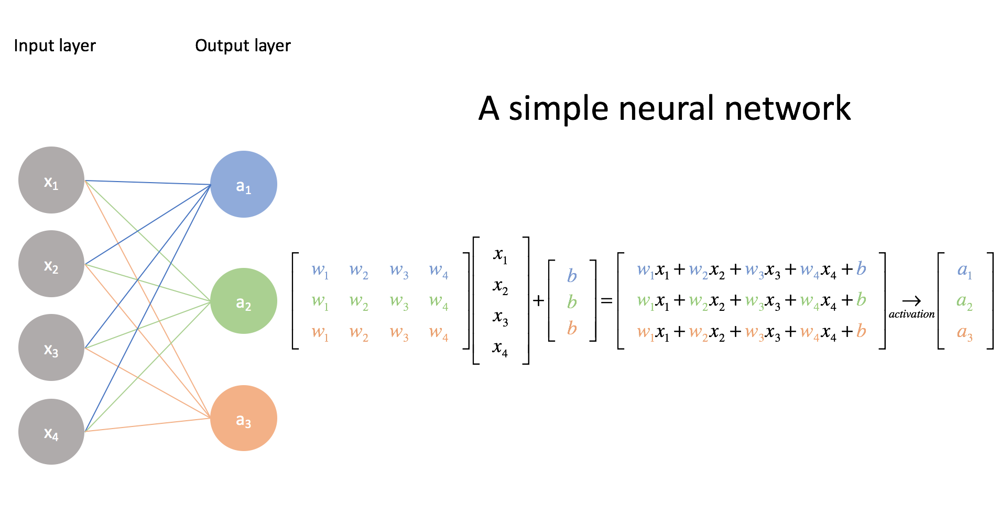

# Semestrální práce - vyšlechtění řídící funkce pro hru Had


## Zadání
Pomocí genetického programování či neuroevoluce vyšlechtěte řídící funkci pro hru had
- Pro ukázku funkčnosti je také nutné zjednodušeně implementovat samotnou hru
- Řídící funkce se bude snažit hrát tak kvalitně jako lidský hráč, tj. nenaráží do stěn, do hada a snaží se sníst všechno náhodně vygenerované jídlo
- Herní plocha může v každé hře změnit svou velikost, řídící funkce by na tomto neměla být závislá
- Vizualizace vývoje neuronové sítě, aby byla čitelná pro člověka
## Pravidla hry
- Hrací plocha je mřížka
- Had se může pohybovat pouze ortogonálně
- Had zemře při nárazu do stěny herní plochy
- Had se nemůže přestat pohybovat
- Pokud had narazí do sebe, zemře
- Pokaždé, když had sní jablko, poroste o jedno políčko
- Cílem hry je dosáhnout co nevětší délky hada
## Popis řešení
### Zvolený algoritmus 
K vyšlechtění řídící funkce byla použita neuroevoluce, tj. za pomocí genetického algoritmu se po generacích vylepšuje neuronová síť.
### Neuronová síť


- Vyzkoušel jsem mnoho rozložení neuronových sítí a nejlepší výkon podala síť s architekturou [24, 18, 4]
- Zvolená architektura je složena ze 3 vrstev - 1 vstupní, 1 schovaná a 1 výstupní, která má po řadě 24, 18 a 4 neuronů
- Jako aktivační funkce byly zvoleny: ReLu pro skryté vrstvy a sigmoida pro výstupní vrstvu
- Rozmezí vah a biasů jsou reálná čísla v rozmezí [-1, 1]
- Had vidí do 8 směrů a kouká se vždy po jablku, zdech a svém těle - vstupní vrstva má tedy 24 neuronů
- Prvních 8 neuronů představuje směr jablka (aktivuje se tedy vždy pouze jeden neuron)
- Dalších 8 neuronů představuje vzdálenost hlavy hada od zdí, vstupem je tedy 1/(vzdálenost od zdi)
- Posledních 8 neuronů představuje vzdálenost hlavy od svého těla, opět vstupem je 1/(vzdálenost od těla), případně 0, pokud v daném směru nepřekáží tělo hada

### Genetický algoritmus
#### Jedinec
- Každý jedinec je tvořený vlastní neuronovou sítí - tedy váhami a biasy
- Všechny váhy a biasy v jednotlivých vrstvách jsou uloženy v matici v podobě 2D pole
- Každá vrsta má vlastní matici, tedy celkově genotyp jedince je realizován pomocí pole matic (3D pole)
- Biasy a váhy jsou uloženy samostatně
```python
class Individual:
    def __init__(self):
        self.neural_net = NeuralNetwork()
        self.snake = Snake()
        self.apple = Apple()
        self.fitness = 0
    ...

class NeuralNetwork:
    def __init__(self):
        self.weights = []
        self.biases = []
        ...
    ...
```



obrázek: https://www.jeremyjordan.me/intro-to-neural-networks/

#### Fitness funkce
- Sílu jedince určuje počet snědených jablek a doba přežití
- Doba přežití: za každý pohyb, který had přežije dostává had 1 bod
- Jablko: za každé snězené jablko dostává had také 1 bod
- Fitness jedince je vypočítáno jako (doba přežití)^2 * (počet snězených jablek)
- Jak je vidět ze vzorce, je kladen důraz na dobu přežití - had se musí naučit vyhýbat se zdem a vlastnímu tělu
- Toto má však své nevýhody: had se začne donekonečna točit v kruhu, tím může získávat body a nemusí řešit kolize

- Řešení tohoto problém: had má nastavený počet kroků, které může provést bez snězení jablka, poté umírá hlady - tedy had je donucen aktivně hledat jablka
- K vyhodnocení fitness je nutné odehrát celou hru:
```python
class Individual:
    def play(self):
        score = 1
        moves_left = MOVES_LEFT
        time_alive = 0
        self.apple.generate(self.snake)
        while True:
            if self.snake.collision_detected() or moves_left == 0:
                self.fitness = (time_alive ** 2) * score
                return
            elif self.snake.eat(self.apple):
                score += 1
                if moves_left + MOVES_LEFT > MOVES_LEFT * MOVES_UPPER_BOUND:
                    moves_left = MOVES_LEFT * MOVES_UPPER_BOUND
                else:
                    moves_left += MOVES_LEFT
                self.apple.generate(self.snake)
            self.move()
            moves_left -= 1
            time_alive += 1
    ...
```
#### Operátor inicializace
- Jedinec může být inicializován dvěma způsoby: načtěním neuronové sítě ze souboru nebo neinformovanou inicializací
- Neinformovaná inicializace - neuronová síť je inicializována zcela náhodně, tj. pro všechny váha a biasy v maticích jsou pseudonáhodně zvoleny hodnoty v rozmezí [-1, 1]
```python
    class NeuralNetwork:
        def __randomize(self):
            config = [INPUT_LAYER] + list(HIDDEN_LAYERS) + [OUTPUT_LAYER]
            for i in range(len(config) - 1):
                # generate random matrices
                self.weights.append(random.uniform(-1, 1, size=(config[i + 1], config[i])))
                self.biases.append(transpose(random.uniform(-1, 1, size=config[i + 1])))
        ...
```
#### Operátor selekce
- Jako operátor selekce je zvolen princip ruletové selekce
- Šance na výběr jedince ke křížení je přímo úměrná jeho fitness:
    - Nejprve se spočítá fitness všech jedinců
    - Poté se tyto hodnoty sečtou
    - Vygeneruje se náhodná hodnota v rozmezí [0, suma fitness všech jedinců]
    - Iterujeme přes podle hodnoty fitness seřazeného pole jedinců
    - V každé iteraci akumulujeme fitness jedinců
    - Vybereme prvního jedince, u kterého akumulovaná hodnota přesáhne tu náhodně vygenerovanou
```python
class GeneticAlgorithm:
    def __roulette_wheel_selection__(self, total_fitness):
        spin = uniform(0, total_fitness)
        curr = 0
        index = 0
        while spin > curr and index < POPULATION_SIZE - 1:
            curr += self.population[index].fitness
            index += 1
        return self.population[index]
    ...
```
#### Operátor křížení
- Jako operátor křížení byl zvoleno n-bodové křížení
- Původně bylo zvoleno uniformní křížení - toto bylo však příliš rušivé a had se učil velmi pomalu až skoro vůbec
- Postup zní následovně:
    - Pro každou vrstu (matici) zvolíme náhodný bod
    - Iterujeme přes všechny řady a sloupce matice
    - Kopírujeme váhy z prvního rodiče dokud nenarazíme na náhodně vygenerovaný bod
    - Kopírujeme váhy z druhého rodiče
    - Toto opakujeme pro všechny vrstvy neuronové sítě
    - To samé provedeme pro biasy
```python
class GeneticAlgorithm:
    def __k_point_crossover__(self, parent1, parent2):
        parent1_weights = parent1.neural_net.weights
        parent2_weights = parent2.neural_net.weights
        parent1_biases = parent1.neural_net.biases
        parent2_biases = parent2.neural_net.biases
        layers_count = len(HIDDEN_LAYERS) + 1
        offspring = Individual()
        offspring_weights = []
        offspring_biases = []

        for i in range(layers_count):
            rows, cols = parent1_weights[i].shape
            # generate random point
            random_row = randint(0, rows - 1)
            random_col = randint(0, cols - 1)
            new_layer = []
            # Weights
            for row in range(rows):
                new_row = []
                for col in range(cols):
                    if row <= random_row or (row == random_row and col <= random_col):
                        weight = parent1_weights[i][row][col]
                    else:
                        weight = parent2_weights[i][row][col]
                    new_row.append(weight)
                new_layer.extend([new_row])
            offspring_weights.append(array(new_layer))

            # Biases
            b_rows = parent1_biases[i].shape[0]
            new_bias = []
            # Generate random point
            random_row = randint(0, b_rows - 1)
            for row in range(b_rows):
                if row < random_row:
                    bias = parent1_biases[i][row]
                else:
                    bias = parent2_biases[i][row]
                new_bias.append(bias)
            offspring_biases.extend([transpose(array(new_bias))])
        offspring.neural_net.weights = offspring_weights
        offspring.neural_net.biases = offspring_biases
        return offspring
    ...
```
#### Operátor mutace
- Jako operátor mutace je zvolen bit-flip operátor:
    - Iterujeme přes všechny váhy a biasy
    - Vygenerujeme náhodnou hodnotu v rozmezí [0, 1]
    - Tuto hodnotu porovnáme se staticky nastavenou pravděpodobností mutace
    - Pokud je vygenerovaná hodnota menší, nahradíme váhu/bias na dané pozici náhodným číslem v rozmezí [-1, 1]
```python
class GeneticAlgorithm:
    def __mutate__(self, individual):
        layers_count = len(HIDDEN_LAYERS) + 1
        for i in range(layers_count):
            # Weights
            rows, cols = individual.neural_net.weights[i].shape
            for row in range(rows):
                for col in range(cols):
                    rand = uniform(0, 1)
                    if rand < MUTATION_RATE:
                        individual.neural_net.weights[i][row][col] = uniform(-1, 1)
            b_rows = individual.neural_net.biases[i].shape[0]
            # Biases
            for row in range(b_rows):
                rand = uniform(0, 1)
                if rand < MUTATION_RATE:
                    individual.neural_net.biases[i][row] = uniform(-1, 1)
    ...
```
#### Elitismus
- 90% jedinců nové generace budou tvořit potomci, které vznikli křížením a mutací
- Abychom nemuseli objevovat již objevená řešení, přidáme nejsilnějších 10% jedinců populace do další generace
- Nevýhody: může se stát, že řešení bude konvergovat do lokálního maxima ve vyhledávacím prostoru všech řešení
```python
class GeneticAlgorithm:
    def mate(self):
        total_fitness = sum(i.fitness for i in self.population)
        new_population = []
        # 90% population of new generation will be offsprings
        for _ in range(floor(POPULATION_SIZE * 0.9)):
            parent1 = self.__roulette_wheel_selection__(total_fitness)
            parent2 = self.__roulette_wheel_selection__(total_fitness)
            offspring = self.__k_point_crossover__(parent1, parent2)
            self.__mutate__(offspring)
            new_population.append(offspring)
        # Pick 10% of old generation and add them to the new one
        new_population.extend(self.population[ceil(floor(len(self.population) * 0.9)):])
        self.population = new_population
        self.generation += 1
    ...
```
## Popis programu
### Systémové požadavky
- Python 3.x.x
- numpy 1.18.3+
- pygame 1.9.6+
- tkinter
- pickle
### Funkcionalita
#### Hlavní nabídka
Při spuštění programu je uživatel přivítán hlavní nabídkou, odtud může spustit buďto hru anebo vycvičit neuronovou síť.


#### Hra
- V nabídce "play" si může uživatel zahrát hru kliknutím na "play game" - ovládání hada pomocí šipek
- Anebo nechat umělou intelingenci si zahrát hru kliknutím na "play AI"
- Při volbě "play AI" uživatel načte vycvičenou neuronovou síť ze souboru


#### Vycvičení neuronové sítě
- V nabídce "Evolve ANN" může uživatel vycvičit neuronovou síť pomocí genetického algoritmu
- Lze vytvořit novou populaci anebo načíst ze souboru a pokračovat ve cvičení


### Nastavení
- Nastavení hry lze měnit v souboru /utils/constants.py
- Nejzajímavější položky jsou:
    - MAP_SIZE: velikost hrací plochy
    - HIDDEN_LAYERS: konfigurace schovaných vrstvev neuronových sítí
    - POPULATION_SIZE: velikost populace
    - MUTATION_RATE: pravděpodobnost mutace
    - MOVES_LEFT: počet pohybů, které může had vykonat bez snězení jablka
```python
# GAME SETTINGS
NEURAL_NETWORK_WINDOW_SIZE = 600
GAME_WINDOW_SIZE = 700
INFO_WINDOW_SIZE = 215
FRAME_RATE = 30
BLOCK_SIZE = 10
NODE_SIZE = 11
NODE_SPACING = NODE_SIZE * 2 + 4
MAP_SIZE = 25

# NEURAL NETWORK
HIDDEN_LAYERS = (20,)
INPUT_LAYER = 24
OUTPUT_LAYER = 4

# GENETIC ALGORITHM
POPULATION_SIZE = 500
MUTATION_RATE = 0.1
MOVES_LEFT = MAP_SIZE * 10
MOVES_UPPER_BOUND = 3

# CONSTANTS
FONT = "freesansbold.ttf"
FONT_SIZE = 15
OFFSET = (GAME_WINDOW_SIZE - MAP_SIZE * BLOCK_SIZE) / 2
UP = 0
RIGHT = 1
DOWN = 2
LEFT = 3
COLOR_WHITE = (255, 255, 255)
COLOR_BLACK = (0, 0, 0)
COLOR_RED = (255, 0, 0)
COLOR_GREEN = (0, 255, 0)
```
### Ukázka
- Ve složce ./bi-zum-ulohy/Semestralni_uloha/data/ naleznete vycvičené neuronové sítě, které si můžete spustit nebo dále vycvičit
- Ve složce ./bi-zum-ulohy/Semestralni_uloha/demo/ naleznete video demonstraci programu